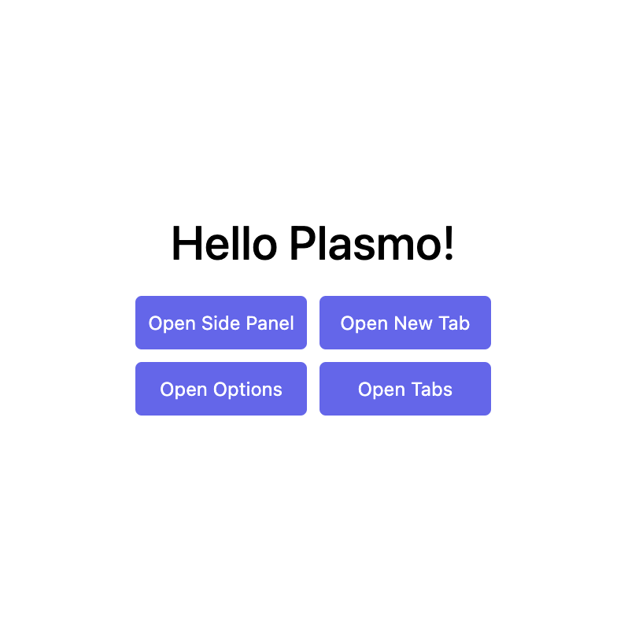

# Plasmo Template

This is a browser extension development template project created with Plasmo.



[中文文档](./README.zh-CN.md)

## Getting Started

First, run the development server:

```bash
pnpm dev
# or
npm run dev
```

Open your browser and load the appropriate development build. For example, if you are developing for the Chrome browser using Manifest v3, use: `build/chrome-mv3-dev`.

You can start editing the popup by modifying `popup.tsx`. It should auto-update as you make changes. To add an options page, simply add an `options.tsx` file to the root of the project, with a React component default exported. Likewise, to add a content page, add a `content.ts` file to the root of the project, import some modules, execute some logic, and then reload the extension in your browser.

For further guidance, [visit our Documentation](https://docs.plasmo.com/).

## Making a Production Build

Run the following:

```bash
pnpm build
# or
npm run build
```

This will create a production bundle for your extension, ready to be zipped and published to the stores.

## Submit to the Extension Stores

The easiest way to deploy your Plasmo extension is to use the built-in [bpp](https://bpp.browser.market) GitHub action. Before using this action, make sure to build your extension and upload the first version to the store to establish basic credentials. Then, simply follow [this setup instruction](https://docs.plasmo.com/framework/workflows/submit), and you should be on your way for automated submission!