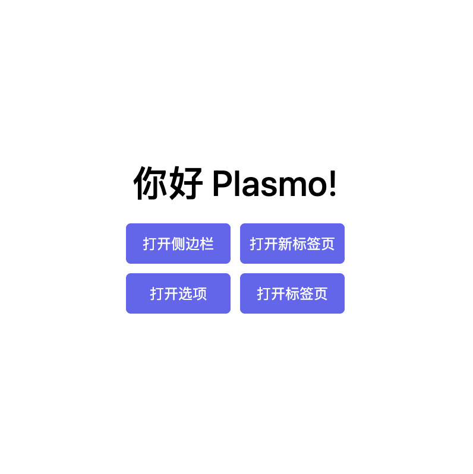

# Plasmo 模版

这是一个使用plasmo创建的浏览器插件开发模版项目。



## 开始使用

首先，运行开发服务器：

```bash
pnpm dev
# 或者
npm run dev
```

打开你的浏览器并加载相应的开发构建。例如，如果你正在为 Chrome 浏览器开发，使用 Manifest v3，使用以下命令：`build/chrome-mv3-dev`。

你可以通过修改 `popup.tsx` 文件开始编辑弹窗。当你进行更改时，它应该会自动更新。要添加选项页面，只需在项目根目录中添加一个 `options.tsx` 文件，并默认导出一个 React 组件。同样地，要添加内容页面，添加一个 `content.ts` 文件到项目根目录，导入一些模块并执行一些逻辑，然后在浏览器中重新加载扩展。

有关进一步的指导，请访问 [官方文档](https://docs.plasmo.com/)。

## 创建生产构建

运行以下命令：

```bash
pnpm build
# 或者
npm run build
```

这将创建一个生产包，准备好打包并发布到商店。

## 提交到插件商店

部署你的 Plasmo 扩展的最简单方法是使用内置的 [bpp](https://bpp.browser.market) GitHub 操作。在使用此操作之前，请确保构建你的扩展并上传第一个版本到商店以建立基本凭证。然后，按照 [这个设置说明](https://docs.plasmo.com/framework/workflows/submit) 进行操作，你就可以自动提交了！
